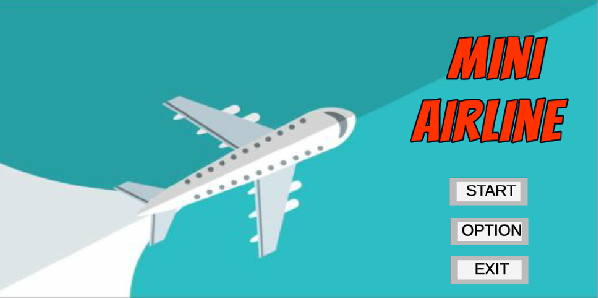
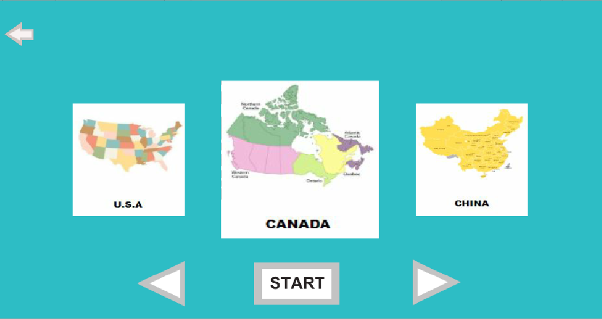
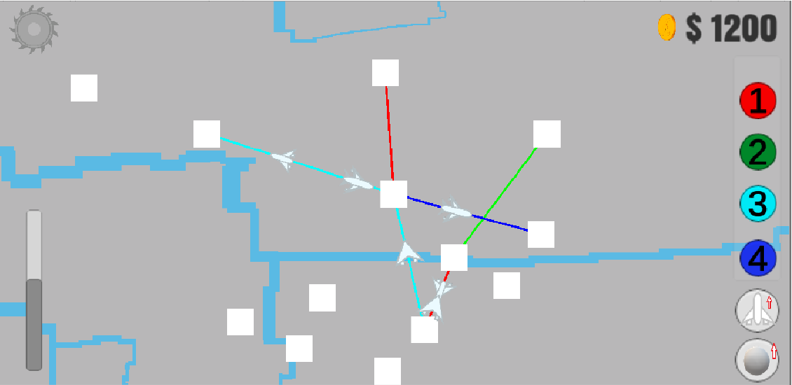

## Mini-Airline

As an inspiration from Dinosaur Polo Club’s game development, I designed a Unity strategy-simulation game called Mini Airline. It is written in C# and intended to construct an airline map. The users will draw a line between airports in order to connect them. As new airports show up, re-graph your lines to keep them functional. The users will decide an efficient way to distribute limited resources and keep the airline running as long as possible.

## The implementation technology
This Unity3D game was completely developed by using the Unity3D game development
platform.
In addition to the Unity 3D, we also used below plugins from the asset store:
- Next-Gen UI (NGUI): provides rich plugins and materials to facilitate the
development.
- Free Platform Game Assets: provides a bunch of materials for free to help us to
generate fantastic textures/animations.
- Easy Poly Map Creator: helps us to quickly create terrain.
- TextMesh Pro: helps us to beautify the text.

## Demo

  

  

  

  

